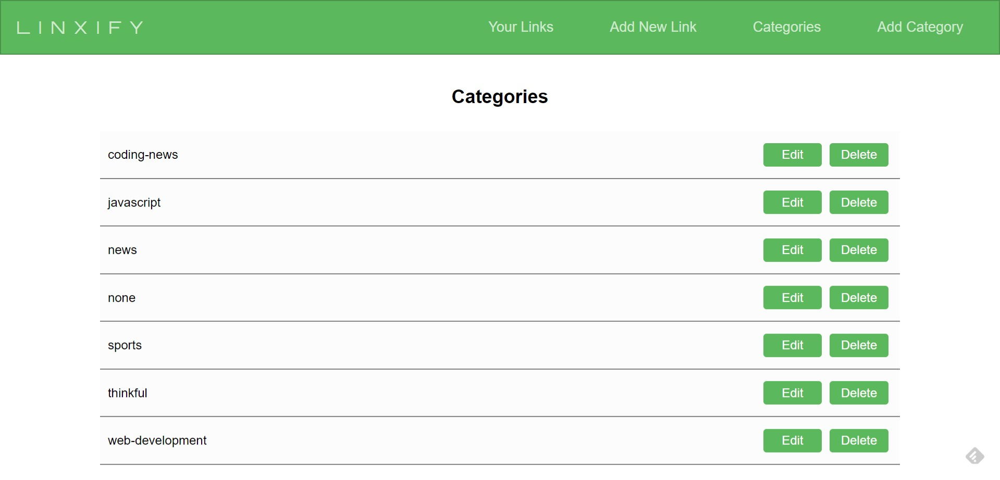

# Linxify - [https://www.linxify.net](https://www.linxify.net)

https://github.com/jbvance/link-saver

https://www.linxify.net/

A simple, web-based app that allows you to save all of your bookmarks in the cloud. Just enter linxify.net/ before any url, and instantly save your bookmark.


Login
=====


Save a link while browsing the web
==================================

Simply enter `linxify.net/` in front of any URL and your link will be saved to the cloud and accessible from any device anywhere. Watch the example below for an illustration.  
  
To save a link with a category, after linxify.net/, simply add the category name followed by two dashes(--) , such as `linxify.net/news--https://www.foxnews.com`. Please note that no spaces are allowed in the category name.

  
  


Search for links
================

Use the search bar to filter your list of links. If the search entered is found in then URL or the title of a link, that will be displayed, while all others are filtered out.

  
  


Edit or add a link manually
===========================

You can also edit or add a link directly within the website, with the option to add some notes about the link you are entering.

  
  


View, edit and add categories
=============================

  
  


Create a .env file

```java
NODE_ENV='test'
DATABASE_URL="localhost"
PORT=8080
JWT_SECRET="secret-is-here"
JWT_EXPIRY='7d'
```

```java
node server.js
```

Output
```java
util.js:227
    throw new ERR_INVALID_ARG_TYPE('superCtor.prototype',
    ^

TypeError [ERR_INVALID_ARG_TYPE]: The "superCtor.prototype" property must be of type object. Received undefined
    at new NodeError (internal/errors.js:322:7)
    at Object.inherits (util.js:227:11)
    at Object.exports.wrap (/mnt/ap/ap/link-saver/node_modules/cheerio-advanced-selectors/index.js:20:8)
    at Object.<anonymous> (/mnt/ap/ap/link-saver/node_modules/metascraper/src/load-html.js:3:55)
    at Module._compile (internal/modules/cjs/loader.js:1085:14)
    at Object.Module._extensions..js (internal/modules/cjs/loader.js:1114:10)
    at Module.load (internal/modules/cjs/loader.js:950:32)
    at Function.Module._load (internal/modules/cjs/loader.js:790:12)
    at Module.require (internal/modules/cjs/loader.js:974:19)
    at require (internal/modules/cjs/helpers.js:93:18)
    at Object.<anonymous> (/mnt/ap/ap/link-saver/node_modules/metascraper/src/index.js:8:18)
    at Module._compile (internal/modules/cjs/loader.js:1085:14)
    at Object.Module._extensions..js (internal/modules/cjs/loader.js:1114:10)
    at Module.load (internal/modules/cjs/loader.js:950:32)
    at Function.Module._load (internal/modules/cjs/loader.js:790:12)
    at Module.require (internal/modules/cjs/loader.js:974:19) {
  code: 'ERR_INVALID_ARG_TYPE'
}
```